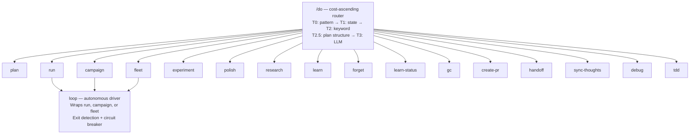

# autodidact

A self-teaching AI harness for [Claude Code](https://docs.anthropic.com/en/docs/claude-code) that grows smarter through use.

Autodidact is a collection of skills, hooks, agents, and a SQLite-backed learning database that gives Claude Code structured orchestration, persistent memory, and the ability to learn from its own mistakes.

## What it does

- **Learns from errors** — captures error patterns, remembers fixes, and injects relevant knowledge into future sessions via FTS5 full-text search
- **Plans before it builds** — a unified `/plan` pipeline that clarifies requirements (Socratic interview), researches the codebase (parallel agents), and produces implementation plans
- **Orchestrates complex work** — three tiers of orchestration: `/run` (single-session), `/campaign` (multi-session), `/fleet` (parallel git worktrees)
- **Experiments autonomously** — `/experiment` runs a metric-driven THINK → TEST → REFLECT loop that hypothesizes changes, measures impact, keeps improvements, and reverts regressions
- **Runs unattended** — `/loop` drives any execution mode autonomously with intelligent exit detection, progress tracking, and [auto-selects the right orchestrator](docs/loop.md#auto-select-mode) based on plan structure
- **Routes cheaply** — a cost-ascending `/do` router resolves most requests with zero LLM tokens (pattern match → active state → keyword heuristic → plan structure) before falling back to LLM classification
- **Checks quality per-edit** — hooks run ruff/mypy on Python files and eslint on JavaScript files after every edit, feeding results back into the learning DB

## Architecture



### Components

| Layer | Count | Description |
|-------|-------|-------------|
| **Core library** | 22 modules | `src/` — db, router, overrides, confidence, graduate, interview, worktree, circuit_breaker, handoff, sync, documents, git_utils, response_analyzer, progress, exit_tracker, loop, experiment, convergence, fitness, self_assessment, session_miner, task_graph |
| **Hooks** | 10 | Python scripts on Claude Code lifecycle events (9 lifecycle hooks + shared constants) |
| **Skills** | 18 | Markdown protocols with 5-section format (Identity, Orientation, Protocol, Quality Gates, Exit) |
| **Agents** | 13 | Specialized personas: autodidact-interviewer, autodidact-fleet-worker, autodidact-quality-scorer, autodidact-python-engineer, autodidact-code-reviewer, autodidact-code-simplifier, autodidact-security-reviewer, autodidact-test-engineer, and 5 research agents |
| **Commands** | 1 | Single `/do` entry point — routes to skills via cost-ascending classifier |

## Prerequisites

| Tool | Required | Purpose |
|------|----------|---------|
| [Python 3.11+](https://www.python.org/) | Yes | Runtime for hooks and core library |
| [uv](https://docs.astral.sh/uv/) | Yes | Package/project management; hooks run through `uv run` |
| [Claude Code](https://docs.anthropic.com/en/docs/claude-code) | Yes | The AI coding tool this harness extends |
| [git](https://git-scm.com/) | Yes | Version control, worktree isolation for fleet |
| [gh](https://cli.github.com/) | For PRs | GitHub CLI for pull requests |
| [ruff](https://docs.astral.sh/ruff/) | For quality checks | Linting/formatting Python files on every edit |
| [mypy](https://mypy-lang.org/) | Optional | Type checking Python files (runs if project has mypy config) |

`ruff` and `mypy` are installed as dev dependencies via `uv sync` — no separate install needed.

## Installation

### Quick install (release)

No checkout required. The bootstrap downloads a release tarball, copies it to `~/.claude/autodidact/`, and registers everything:

```bash
curl -fsSL https://github.com/Jason-Adam/autodidact/releases/latest/download/install.sh | bash
```

| Install command | Effect |
|-----------------|--------|
| `bash install.sh` | Install the latest release |
| `bash install.sh --version v0.1.0` | Pin a specific tag |
| `bash install.sh --update` | Re-fetch the latest release (preserves `learning.db` and other state) |
| `bash install.sh --uninstall` | Remove symlinks/hooks (preserves `learning.db`) |

Requires `uv`, `curl`, and `tar` (no `git` needed). The downloaded tarball is verified against the release's `sha256sums.txt` before extraction. Unlike the source install, this **copies** files instead of symlinking a checkout, so you are not tied to a maintained clone.

### Install from source (development)

```bash
git clone https://github.com/Jason-Adam/autodidact.git
cd autodidact
uv sync                       # install dependencies and create .venv
uv run pre-commit install     # set up pre-commit hooks (ruff lint, ruff format, mypy)
./install                     # install globally to ~/.claude/ (symlinks the checkout)
```

Both paths do the same thing:
1. Wire skills, agents, and commands into `~/.claude/` (symlinks pointing at the source/install dir)
2. Register 10 hooks in `~/.claude/settings.json` (hooks run via `uv run` so they have access to project dependencies)
3. Initialize the learning database at `~/.claude/autodidact/learning.db`

The difference: the source install symlinks your live checkout (edits take effect immediately), while the release install copies a fixed snapshot into `~/.claude/autodidact/`.

To uninstall the source install:

```bash
./install --uninstall
```

The learning database is preserved on uninstall. Delete `~/.claude/autodidact/` manually to remove it.

## Usage

Everything goes through `/do` -- the cost-ascending router resolves intent and dispatches to the right skill.

```
/do plan the auth refactor        # routes to plan skill
/do research how caching works    # routes to research skill
/do commit these changes          # routes to gc skill
```

| Skill | Purpose | Docs |
|-------|---------|------|
| plan | Clarify -> Research -> Design pipeline | [skill ref](docs/commands.md#plan----clarify-research-design) |
| run | Single-session sequential orchestration | [skill ref](docs/commands.md#run----single-session-orchestration) |
| campaign | Multi-session persistent orchestration | [skill ref](docs/commands.md#campaign----multi-session-campaigns) |
| fleet | Parallel worktree execution (multi-wave, dependency-aware) | [skill ref](docs/commands.md#fleet----parallel-worktree-execution) |
| experiment | Metric-driven autonomous optimization | [skill ref](docs/commands.md#experiment----metric-driven-optimization) |
| loop | Autonomous unattended execution (auto-selects mode) | [loop.md](docs/loop.md) |
| learn | Teach the system facts for future injection | [skill ref](docs/commands.md#learn----teach-the-system) |
| polish | Parallel code review, security review, and simplification | [skill ref](docs/commands.md#polish----parallel-code-quality) |
| forget | Decay or remove learnings from the database | [skill ref](docs/commands.md#forget----decay-learnings) |
| learn-status | Confidence stats and knowledge inventory | [skill ref](docs/commands.md#learn-status----knowledge-inventory) |
| gc | Autonomous git commits -- auto-branches, atomic commits | [skill ref](docs/commands.md#gc----autonomous-git-commits) |
| create-pr | Create pull requests with thorough descriptions | [skill ref](docs/commands.md#create-pr----create-pull-requests) |
| research | Parallel codebase research with persisted findings | [skill ref](docs/commands.md#research----standalone-codebase-research) |
| handoff | Compact session transfer document | [skill ref](docs/commands.md#handoff----session-transfer) |
| sync-thoughts | Sync docs to ~/.planning/ for cross-project access | [skill ref](docs/commands.md#sync-thoughts----cross-project-sync) |
| debug | Structured debugging with root cause isolation and regression guards | [skill ref](docs/commands.md#debug----structured-debugging) |
| tdd | Test-driven development -- RED/GREEN/REFACTOR cycle | [skill ref](docs/commands.md#tdd----test-driven-development) |

## Routing overrides

`/do` resolves intent to autodidact skills by default. If you install third-party Claude Code plugins whose skills are namespaced (e.g. `some-plugin:plan`), you can redirect routing to them for specific working directories via an opt-in JSON config at `~/.claude/autodidact/routing-overrides.json` (override path with `$AUTODIDACT_OVERRIDES_PATH`).

Absence of the config file preserves default behavior exactly — nothing is automatic.

```json
{
  "plan_dirs": [".planning/plans"],
  "path_overrides": [
    {
      "prefix": "/absolute/path/to/your/project",
      "map": {"plan": "some-plugin:plan", "run": "some-plugin:run"},
      "patterns": [{"regex": "^/?deploy\\b", "skill": "some-plugin:deploy"}],
      "plan_dirs": ["custom/plans", ".planning/plans"]
    }
  ]
}
```

Semantics:

- **Longest-prefix match** — when multiple prefixes match `cwd`, the longest wins (so nested projects can refine their parents' config).
- **`patterns`** short-circuit classification when the prompt matches a regex (first match wins, `re.search` semantics). Use for skills autodidact doesn't know natively.
- **`map`** rewrites the final bare skill name (e.g. `plan` -> `some-plugin:plan`) *after* classification and plan-gate resolution. Bare signals (`direct`, `batch`, `classify`) are never mapped.
- **`plan_dirs`** overrides which directories the plan gate scans for `*.md` files. Path-scoped `plan_dirs` win over the top-level default.
- **Reload** — the config is read on every router invocation (fresh Python process per hook), so edits take effect on the next prompt.

See `examples/routing-overrides.json` for a complete placeholder template.

## Deep dives

- [Skill reference](docs/commands.md) — detailed usage and examples for every skill
- [Loop and autonomous execution](docs/loop.md) — exit detection, circuit breaker, auto-select mode
- [Learning database](docs/learning-db.md) — knowledge lifecycle, confidence math, FTS5 queries
- [Planning and persistence](docs/planning.md) — `.planning/` directory structure, document syncing

## Tests

```bash
uv run python3 -m pytest tests/ -v
```

553 tests covering the learning DB, confidence math, router classification, model routing, path-scoped routing overrides, interview scoring, circuit breaker, response analysis, git progress detection, exit tracking, loop orchestration, fleet recovery, conflict detection, task graph partitioning, experiment state management, convergence detection, fitness expression evaluation, self-assessment, session mining, and doc verification.

## Design principles

- **Python stdlib only** — no pip installs in `src/` or `hooks/`
- **Global installation** — one install serves all projects; learning persists across repos
- **Cost-ascending routing** — resolve at the cheapest tier; most requests cost zero LLM tokens
- **Graceful degradation** — all hooks catch errors and exit 0; a broken hook never blocks your work
- **Confidence-based knowledge** — learnings earn trust through repeated successful use, not just existence
- **Worktree-aware** — learnings shared across worktrees; `.planning/` state isolated per task

## License

[MIT](LICENSE)
